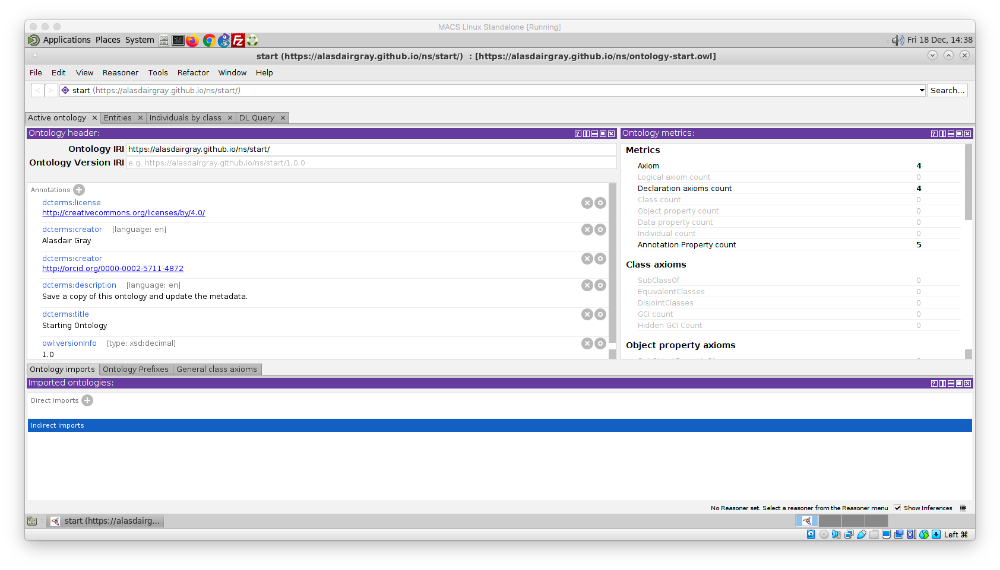
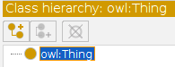
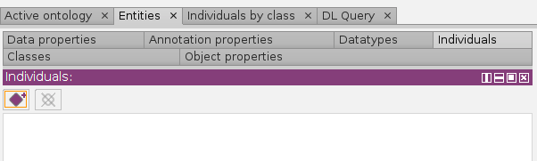
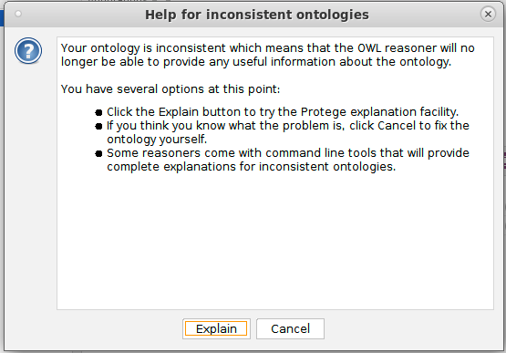
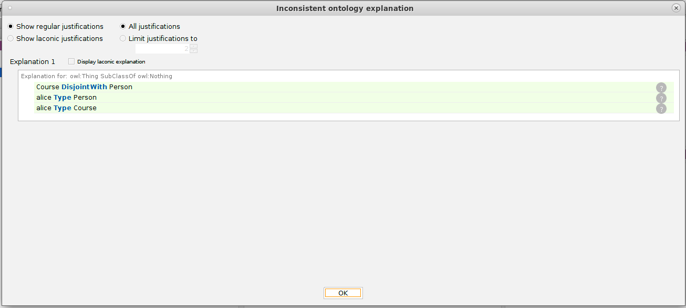
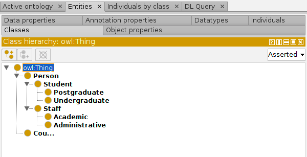
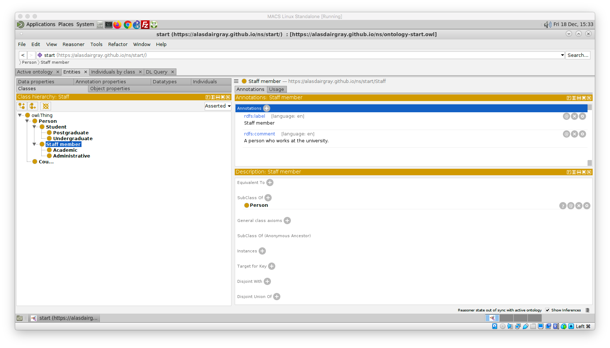
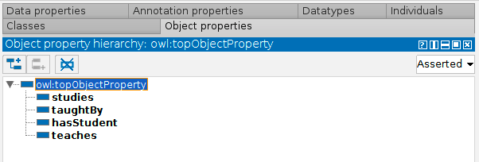

# Basic OWL Lab Session

In this OWL lab you will get started using Protégé to create and edit an ontology.

Remember to regularly save your work as you go through by clicking 'File -> Save'

## Starting Protégé

### Local Installation

If you have installed your own copy of Protégé then you should start this up in the usual way for your platform.

### MACS Lab/VM Installation

To open Protégé on the MACS Linux machines or VM follow these steps:

1. Click on the 'Applications' menu in the top left
1. Choose protege from within the Programming menu
1. Click 'Not Now' from the plugins popup menu once Protégé has started

## Opening Shell Ontology

I have created a shell ontology which contains basic metadata that all ontologies should provide as a minimum. We are going to use this as a starting point for the Lab.

1. Select 'File -> Open from URL...'
1. Enter the URL for the ontology
   `https://alasdairgray.github.io/ns/ontology-start.owl`
1. Save the ontology to your local disk
   1. 'File -> Save'
   1. Select 'Turtle Syntax'
   1. Give the ontology a suitable filename
   1. Choose where to save the file and click 'Save'

Your ontology should look something like the following screenshot.



## Updating the Ontology Metadata

To edit a metadata element, click on the circle icon and type in the new value. Do this for the following elements:

- `dcterms:creator` where the value is `Alasdair Gray`; put your own name in
- `dcterms:description` replace with your own description text
- `dcterms:title` replace with your own ontology title

To remove a metadata element, click on the x in a circle next to the element. Do this for the creator element that has a URL.

## Creating our first Classes

We will now create some classes to represent people and courses within a university.

1. Click on the 'Entities' tab

1. Click on `owl:Thing`; all classes must be defined below this most general class

1. Click on the icon containing two yellow balls with a + sign


1. Type in the name of the class that we are creating `Course`
   **Note:** for the ease of discussion we will use labels as names. In real-world scenarios it is considered best practice to use opaque identifiers.

1. Now create a sibling class to `Course` called `Person` ; you can do this same way as for the `Course` class or use the add sibling class option.

1. Now let's declare `Course` and `Person` to be disjoint since no individual could be both an instance of both of them.

   1. In one of the classes, click on the `+` icon next to the text `Disjoint With`
   1. In the popup window, browse through the class hierarchy and choose the class that you are declaring to be disjoint with
   

## Running the Reasoner

We will now run the reasoner to ensure that our ontology is consistent. It is good practice to regularly check your ontology for consistency.

1. Click on the 'Reasoner' menu item
1. Select 'HermiT'
1. Click on the 'Reasoner' menu item
1. Select 'Start reasoner'

## Creating some Individuals

We will now create some individuals for our ontology.

1. Click on the 'Individuals' tab within the 'Entities' tab
1. Click on the purple diamond icon
   
1. Create an individual called `alice` by typing 'alice' into the popup and clicking OK
1. Declare `alice` to be of type `Person` by clicking on the `+`  icon next to `Types` and then choosing `Person` from the 'Class hierarchy'
1. Create the individual `f20bd` to be of type `Course`

## Deliberate Inconsistency

We are now going to create a deliberate inconsistency so that we understand when the reasoner is informing us of a problem.

1. Select `alice` from the individuals that you created
1. Click on the `+` icon next to `Types` and state that `alice` is of type `Course`
1. Synchronise the reasoner by going to the 'Reasoner' menu and selecting 'Synchronize reasoner'

You should now see the following screenshot



Click on the 'Explain' button to get an indication of what axioms in the ontology have led to the inconsistency. The explanation shown in the following screenshot states that `Course` and `Person` are disjoint and that `alice` has been declared to be of type both of them.



Click OK and then fix the ontology by removing the declaration that `alice` is of type `Course`.

Note that Protégé has highlighted in red the two axioms that led to the contradiction.

Once you have performed your fix, synchronise the reasoner.


## Creating Multiple Children Classes
We are now going to create multiple children to be subclasses of `Person`. These classes will be for staff and students and their sub classes. We will not declare them to be disjoint since it is permissible for staff members to be students.

1. Click on the 'Classes' tab within the 'Entities' tab

1. Choose the `Person` class

1. Click on the 'Tools' menu and select 'Create class hierarchy...'

1. Within the resulting popup enter the class names; each on their own line with indentation to capture the desired hierarchy.

   ```
   Staff
   	Academic
   	Administrative
   Student
   	Undergraduate
   	Postgraduate
   ```

   **Note:** you can use the prefix and suffix options at the bottom of the popup to give all your classes the same start or end.

1. Uncheck the checkbox for making siblings disjoint since a student could be a staff member

1. Click 'Finish'

You should now see the classes in the class hierarchy



## Bad habits come easily

Unfortunately, Protégé does not encourage best practice. In this case, I mean that we have not defined any of our classes by annotating them with labels and descriptions; the class identifiers we have been using do not count as labels and should not be relied upon to define the entity. 

1. Select the `Staff` class
1. Click on the `+` icon next to 'Annotations'
1. Select `rdfs:label` and enter the text `Staff member` in the box at the side 
1. Select `en` from the 'Lang' dropdown item and click OK
1. Click on the `+` icon again
1. Select `rdfs:label` and enter the text `A person who works at the university.`
1. Again select `en` from the 'Lang' dropdown and click OK.



Now annotate all the other classes.

## Creating Object Properties

Now that we have some classes, we want to be able to relate them. We will create relationships between academics, courses, and students.

In line with good practice, we will assume that you are annotating the properties with labels and descriptions. The instructions here will focus on the creation of the object properties.

We will create multiple object properties at the same time. Again, you can have a hierarchy of properties, although this is not as common.

1. Click on the 'Object properties' tab

1. Select the `owl:topObjectProperty` property

1. Click on the 'Tools' menu item and select 'Create object property hierarchy...'

1. Enter the following properties into the popup window

   ```
   teaches
   taughtBy
   studies
   hasStudent
   ```

   Note that I have not been consistent in the way I'm calling my properties. This is to show you different styles. Instead of `taughtBy` it would be better to use `hasTeacher`.

1. Do not make the properties disjoint



Now provide labels and definitions for each of the properties.

## Defining Characteristics of our Object Properties

We will only define domain, range, and inverse property definitions for the properties that we created since non of the other characteristics hold for these properties.

1. Click on the `studies` property
1. Click on the `+` icon next to 'Inverse Of'
1. In the list of properties, select `hasStudent` and click OK
1. If you click on `hasStudent` you will see that it now has `studies` as an inverse property
1. Go back to `studies` and click on the `+` icon next to Domains
1. Select `Student` from the class hierarchy
1. Now click on the `+` icon next to Ranges and select `Course` from the class hierarchy

Now repeat this for the other properties. Courses should be taught by an academic.

## Defining Data Properties

This is done in the same way as for Object Properties. 

Create a data property `hasName` that gives the name of a Person, i.e. its domain is `Person`.

Create a data property `courseTitle` that gives the title of a Course.

## Exploiting the Reasoner

We are now going to declare the `:alice :studies :f21bd`. 

1. Create the individual `:f21bd` but do not declare it to be of any type.
1. Select `:alice` and click on the `+` icon next to 'Object property assertions'
1. Enter `studies` and `f21bd` into the respective boxes and click OK

Now synchronise the reasoner and see what it has inferred for `:alice` and `:f21bd`. *They should both have types highlighted in yellow.*